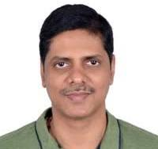
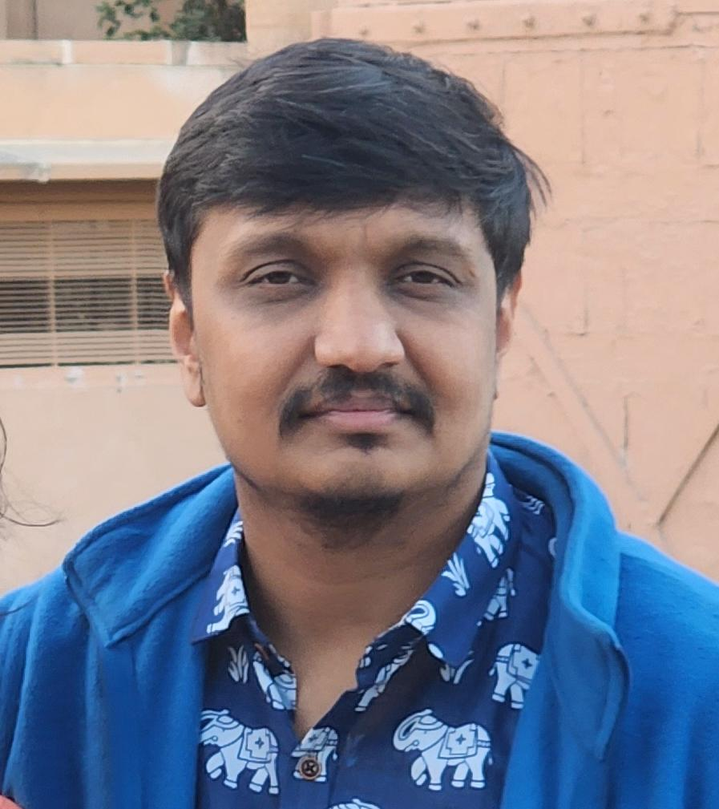
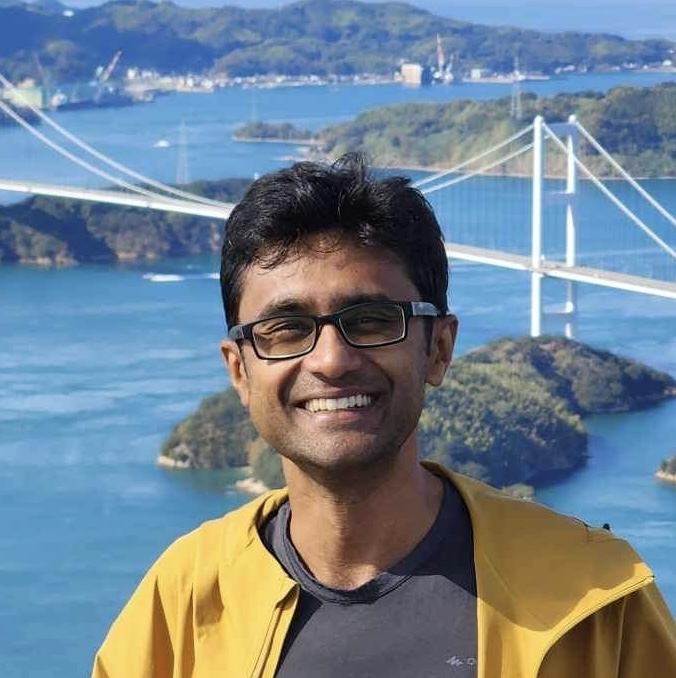
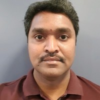

# Tutorial on Advanced 2D & 3D Imaging for Mobile Systems

## Abstract  
Advanced 2D and 3D Imaging for Mobile Systems explored advanced imaging technologies for smartphones and Head Mounted Displays, including AI ISPs, Multi-Frame Processing and depth based reprojection, alongside heterogeneos computing for efficient edge porting. It aims to provide insights into the latest innovations shaping modern device capabilities

## Introduction to Mobile Imaging Systems 
Speaker: Kiran Nanjunda Iyer  
Advanced 2D & 3D Imaging for Mobile Systems tutorial which explores advanced imaging technologies for smartphones and HMDs, including AI ISPs, multi-frame processing, and depth-based reprojection, alongside heterogeneous computing for efficient edge porting. It aims to provide insights into the latest innovations shaping modern device capabilities.

## Image Signal Processing  
Speaker: Nutan Sairam  
Image Signal Processing (ISP) technology is an indispensable part of digital imaging systems, responsible for converting raw data captured by image sensors (usually in RAW format) into final, high-quality images. The evolution of ISP technology from traditional ISP to computer vision and then to artificial intelligence has been significant. We will cover this journey for smartphones.

### Hardware ISP  
Early ISPs relied mainly on hardware and fixed algorithms to process images. These processing steps included Demosaicing (converting RAW images into RGB images), white balance adjustment, colour correction, sharpening, noise suppression, etc.  
Advantages: Due to the fixed processing steps, traditional ISPs could achieve fast, real-time image processing suitable for early digital cameras and mobile phones.  
Limitations: Fixed algorithms struggled to cope with all shooting conditions, especially in low light or high dynamic range environments, often resulting in less-than-ideal image quality.

### Software Enhanced ISP  
With the development of computer vision and imaging technology, ISPs began to integrate more vision-based functionalities, such as multi-frame processing to improve image processing effects. SW-ISP can co-work with Hardware ISP for pre /post processing refinements.  
Advantages: Evolution of Computer Vision and Computational Imaging algorithms (such as multi-frame alignment, merging, exposure fusion, tone mapping) helped to improve image quality, for example, by dynamically adjusting motion blur, detail, noise, exposure and brightness based on scene content analysis.  

## AI-Powered ISP (AI-ISP)
Speaker: Dr.Saurabh Kumar  
In recent years, the development of artificial intelligence and deep learning has completely changed the landscape of ISP. AI-ISP uses vast amounts of data and deep neural networks to learn the best ways to process images. AI-ISP is particularly effective in various image restoration tasks such as Demosaicing, denoising, super-resolution etc, producing high-quality images that are difficult to achieve with SW-ISP. Beyond basic image processing tasks, AI-ISP can also perform advanced functions such as multi-frame merging, multi-resolution fusion etc further enhancing the image quality. AI-ISP powered several new use cases like Nightography and High-resolution (50M/200M) imaging.

## Computational Methods for Image Artefact Removal
Speaker: Dr.Pawan Prasad  
Computational methods are transforming the way we handle common image artifacts like reflections and shadows. These issues significantly compromise image fidelity and challenge downstream computer vision tasks by concealing true scene content and distorting illumination. This talk dives into cutting edge approaches from physics based modelling to deep learning - designed to robustly separate artifacts from the authentic image data. We will examine specific techniques, including single image reflection removal using deep neural networks and inverse rendering strategies for realistic shadow elimination. The goal of these methods is to restore visual integrity, thereby boosting the reliability and accuracy of systems used in autonomous navigation, medical imaging and professional photo editing.

## Depth Perception and its Role in Depth-Based Reprojection
Speaker: Basavaraja Vandrotti  
Depth perception is essential for geometric aware passthrough in head mounted displays. By accurately estimating the distance and shape of real world objects, the system can reconstruct a precise geometric understanding of the environment. This depth information enables depth based reprojecion, allowing the passthrough view to be correctly warped and stabilized as the user moves their head. As a result, virtual and real elements align more naturally, reducing motion artifacts and enhancing comfort, immersion and situational awareness.

## Heterogeneos Computing
Speaker: Sujoy Saha  
Hetereogeneous computing is a system that uses more than one type of processor or core, such as a combination of CPUs, GPUs, and DSPs, to perform tasks more efficiently. This approach assigns specific workloads to the processor that is best suited for the job, leading to improved performance and energy efficiency compared to using only one type of processor. Hetereogeneous computing is essential in modern computer vision and image understanding, which require intense computational power and real time processing. It is a prevailing trend driven by the demands of complex AI and Computer Vision applications, offering the best balance of performance, power and efficiency.

# Speaker Biographies
## Kiran Nanjunda Iyer
  
Kiran Nanjunda Iyer holds the position of Senior Director at Samsung R&D Institute India Bangalore, where he heads the XR Perception Group. 

## Dr.Pawan Prasad
  
Dr.Pawan is the Head of the XR Interactions team at Samsung R&D Institute India Bangalore, where he leads the development of advanced interaction technologies for head-mounted displays, including hand tracking and eye tracking. He brings over 15 years of experience in computer vision and computational imaging, with AI playing a central role throughout his work. He received his MS and PhD degrees from IIT Madras and has authored more than 40 patents and over 25 research publications.

## Basavaraja Vandrotti
  
Basavaraja Vandrotti is the Head of the XR Scene Perception at Samsung R&D Institute India Bangalore, where he leads the development of advanced scene perception technologies for depth estimation, scene understanding and passthrough. Prior to Samsung, he was with Nokia Inc., India and USA, with responsibilities in developing computer vision solutions for smartphones & AR/VR devices. He holds a Master degree from Indian Institute of Science (IISc) Bangalore. He has 20 years of professional experience in Computer Vision and Machine Learning, and published around 18+ international conference papers and 40+ patents

## Dr.Saurabh Kumar  
  
Dr.Saurabh Kumar is a researcher at Samsung R&D as part of the Computational Imaging Group. Before that, I did a Postdoc with Intelligence and Sensing Lab at Osaka University, working on Computational 3D Sensing and Computational Optics for Computer Vision. My Ph.D. was in Computational Imaging and Vision; I was part of the Vision and Image Processing Group at IIT Bombay, supervised by Subhasis Chaudhuri.  
[https://saurabhkm.github.io](https://saurabhkm.github.io/)

## Nutan Sairam
  
Nutan is working in AI Computational ISP team at Samsung R&D Institute India Bangalore, where he leads the development of Multi-Frame processing solutions for Samsung flagship phones. He brings over 16 years of experience in Image/Video processing, computer vision and computational imaging. He received his M.Tech in Electrical Engineering from IIT Kanpur and has authored 3 patents and 2 research publications.

